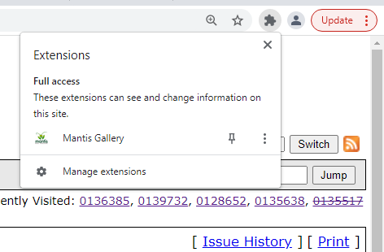
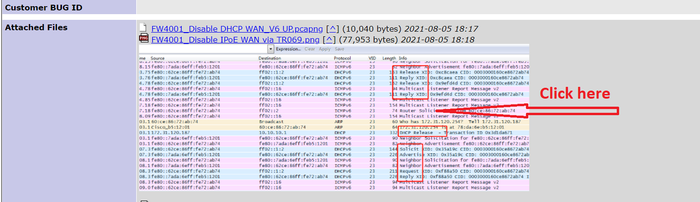
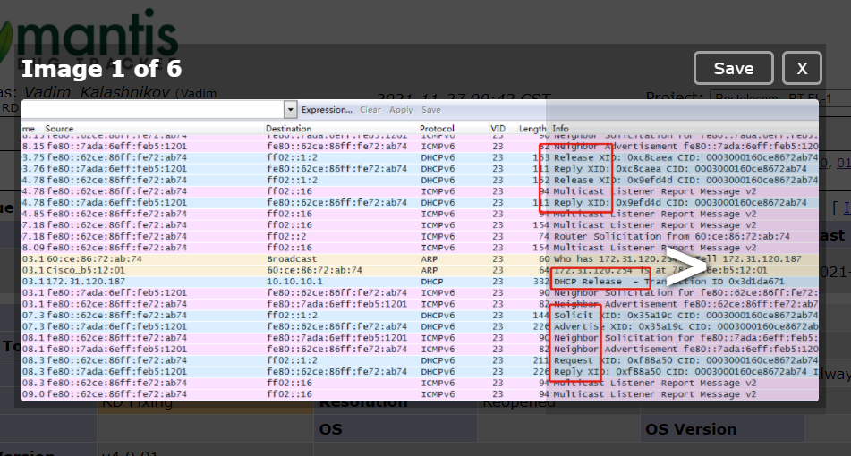

### Mantis Gallery
##### Это расширение для браузера Chrome позваляет улучшить функционал багтрекера Mantis.
##### Расширение позволяет просматривать, прикрепленные картинки в виде удобной галереи, непосредственно в браузере, без необходимости предварительного сохранения картинок на ПК.

#### Установка:
* Для установки в окне браузера Chrome перейдите на страницу chrome://extensions/ 
* Включите режим разработчика в правом верхнем углу
* Нажмите на кнопку "Загрузить распакованное расширени", после чего выберите путь к корневой папке этого расширения на вашем ПК.
* При первом использовании, если необходимо, нужно разрешить применение этого расширения для страниц Mantis'a

#### Использование:
* На странице Mantis'a перейдите к прикрепленным файлам
* Кликните по интересующей Вас картинке

* Перелистывание прикрепленных картинок доступно как с использованием мыши, так и с помощью клавиатуры (стрелки влево/вправо)
* Выход из режима просмотра доступен так же по конпке Esc

### Mantis Gallery
##### This extension for Chrome browser allows you to extend the functionality of the Mantis bug tracker.
##### The extension allows you to view attached pictures as a convenient gallery directly in the browser with needless to first save the pictures on your PC.

#### Installation:
* Followo to chrome://extensions/ browser page
* Turn on developer mode in the upper right corner
* Click on the "Load unpacked extensions" button, then select the path to the root folder of this extension on your PC.
* When using this one for the first time, please allow secure policy (if needed) for this extension

#### Usage:
* Follow to attached files on Mantis page
* Click on the picture you are interested in

* Scrolling through pictures is available both with the mouse and with the keyboard (left / right arrows buttons)
* Exiting the application is also available by the Esc key

